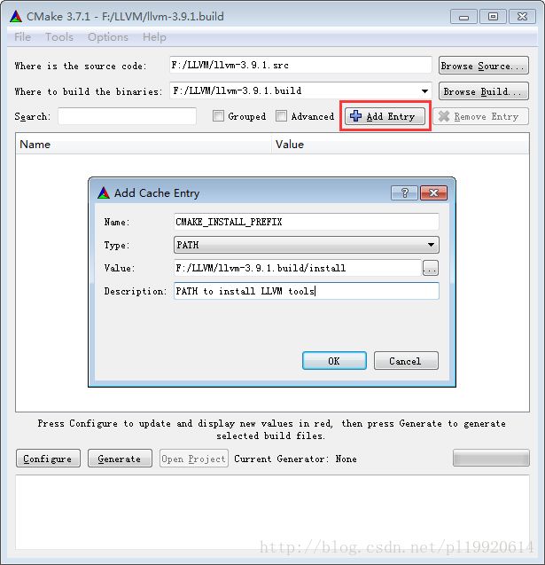
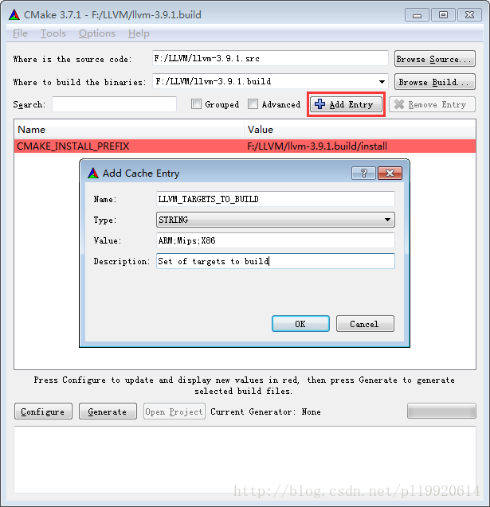

# VSLC
A Very Simple Language Compiler.

## Build Instructions
The following dependencies are tested successfully but not necessarily required to be the same on your platform.
Some can perform well even use packages with lower version numbers.

### Build For Windows

#### Dependencies
- Operating System: Windows (Windows 10 update 1803)
- Build tools: msvc
- Build tool chain: cmake (3.11)
- Development platform: Visual Studio 2017

#### Instructions

1. Download the [llvm source code package](http://releases.llvm.org/download.html) in a directory and un-archive it
into a directory named `llvm.src`. Make a directory named `llvm.build` on the same level of `llvm.src`. Then make a
directory named `install` in the `llvm.src` directory. The result of this step will be like this.
```cmd.exe
> DIR
llvm.build <DIR> XX-XX-XX XX:XX
llvm.src   <DIR> XX-XX-XX XX:XX
...
> CD llvm.build\
> DIR
install    <DIR> XX-XX-XX XX:XX
...
```

2. Build the llvm Visual Studio project with cmake GUI:
- Set the `source code path` and `build binary path` on the top path choosing panels.
- Add the following two entries, please notice changing the paths on the screenshots to yours:


- Hit the `Configure` button to specify the generator for this project as `Visual Studio 15 2017` and choose `Use default native compilers`.
- Hit the `Generate` button to generate a Visual Studio Solution.

3. Open `LLVM.sln` and select the target `INSTALL` as the startup item. Then click `Generate` > `Generate INSTALL`.

4. Create a system environment variable named `LLVM_DIR` with the value of the `install\lib\cmake` directory's **full path**.

5. Open a cmd shell in another working directory. Clone our source code in it:
```cmd.exe
MD VSLC
CD VSLC
git clone git@github.com:EnderQIU/vslc.git src\
```

6. Build the vslc Visual Studio project with cmake in command shell:
```cmd.exe
MD build\
CD build\
cmake -DCMAKE_BUILD_TYPE=Debug -G "Visual Studio 15" ../src
```

7. Open the generated `vslc.sln`. Build & run target `vslc`.

### Build For macOS

#### Dependencies
- Operating System: macOS (10.13)
- Build tools: clang++
- Build tool chain: cmake (3.11)
- Development platform: Xcode 10 (10A255)

#### Instructions
```bash
mkdir VSLC/
cd VSLC/
git clone git@github.com:EnderQIU/vslc.git src/
mkdir build/
cd bui

brew install llvm

echo "LLVM_DIR=/usr/local/opt/llvm/lib/cmake" >> ~/.zshrc && source ~/.zshrc                 # For users using oh-my-zsh
echo "LLVM_DIR=/usr/local/opt/llvm/lib/cmake" >> ~/.bash_profile && source  ~/.bash_profile  # For users using bash

cmake -DCMAKE_BUILD_TYPE=Debug -G "Xcode" ../src
```

## Usage
If specified a source file name, it will compile it and output the binary IR code file.
```bash
> vslc --help
usage: vslc [options] ... filename
options:
  -v, --verbose    Enable verbose mode, display the output of scanner and parser.
  -o, --output     Specify output file name. Default is a.out. (string [=a.out])
  -?, --help       print this message
```


Else, it will enter the interactive shell mode. The '-v' option is still valid.
Use the backslash to start a new line.
```bash
> vslc
VSLC v0.1 interactive shell
>>> FUNC main(){\
>>> VAR i\
>>> i := i + 1\
>>> }
>>> 
```

## Acknowledgement
Portion of this software may utilize the following copyrighted materials, the use of which is hereby acknowledged.

- [cmdline: A simple command line parser for C++](https://github.com/tanakh/cmdline) Copyright (c) 2009, Hideyuki Tanaka
- [first-follow: Calculator for finding first, follow and predict sets for a grammar.](https://github.com/MikeDevice/first-follow) MIT License 
- [pytablewriter: A Python library to write a table in various formats](https://pytablewriter.rtfd.io/) MIT License

## LICENSE
WTFPL – Do What the F*** You Want to Public License
